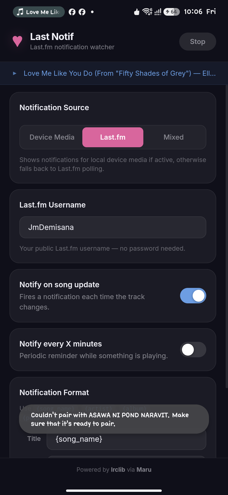

# LastNotif

LastNotif is a standalone Android background service application that monitors active music playback—either by listening to local media sessions or polling the Last.fm API—and broadcasts details and real-time synced lyrics through system notifications.

This is particularly useful for smart bands, smartwatches, and fitness trackers (like Xiaomi Mi Band / smart bands using Zepp Life / Gadgetbridge / etc.) that mirror system notifications, enabling you to read track information and live lyrics on your wrist!



## Features

- **Multi-Source Track Detection**:
  - **Device Media**: Monitors local media playback via an Android Notification Listener.
  - **Last.fm**: Polls Last.fm now-playing API (via the Maru website's endpoint). No password required—just your public username.
  - **Mixed Mode**: Automatically uses local device media if active, otherwise falls back to Last.fm polling.
- **Real-Time Synced Lyrics**:
  - Fetches synced lyrics (powered by [lrclib](https://lrclib.net/) via Maru).
  - Matches playback timestamp and displays the current lyric line as a system notification (updates roughly every few seconds).
- **Fully Customizable Formatting**:
  - Format title and body strings using template tags: `{song_name}`, `{artist}`, `{album}`, and `{polling_method}`.
- **Periodic Reminders**:
  - Configurable periodic notification reminders while tracks are playing.
- **Boot Persistence**:
  - Automatically schedules and restarts the poller service on device boot so you never miss a track.
- **Modern Hybrid UI**:
  - A clean, beautiful dark-themed WebView interface built on Inter font and responsive controls.

## Requirements

- **Android 8.0+** (API Level 26 or higher)
- **Notification Access permission** (required only if using "Device Media" or "Mixed" source modes to read system media playback metadata).

## Building from Source

You can build the project using Android Studio or the Gradle wrapper command-line tools.

Ensure you have the Android SDK installed and `ANDROID_HOME` configured.

```bash
# Clone the repository
git clone https://github.com/JmDemisana/LastNotif.git
cd LastNotif

# Compile the release APK
./gradlew assembleRelease
```

The compiled APK will be output to: `app/build/outputs/apk/release/maru-lastnotif.apk`.

## License

This project is licensed under the **GNU General Public License v3.0 (GPL-3.0)**. See the [LICENSE](LICENSE) file for details.
